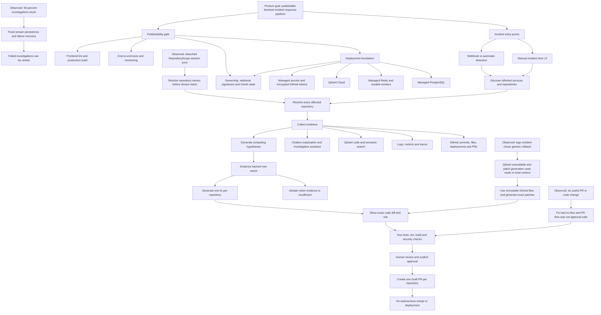
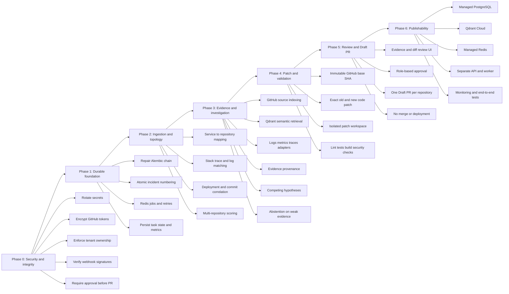
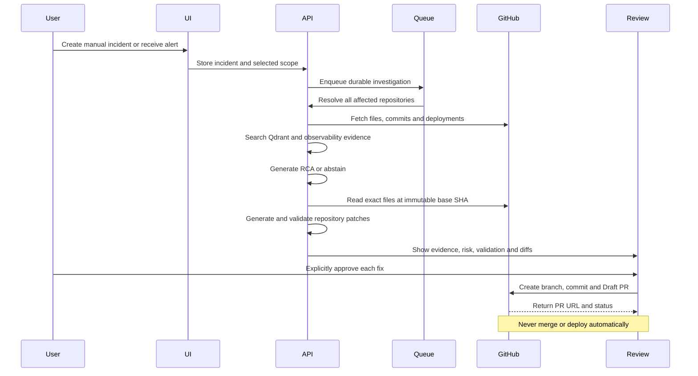
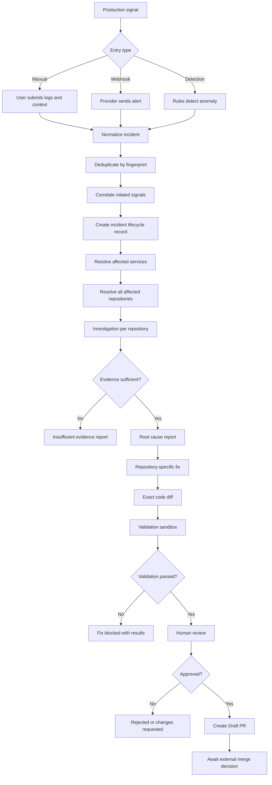
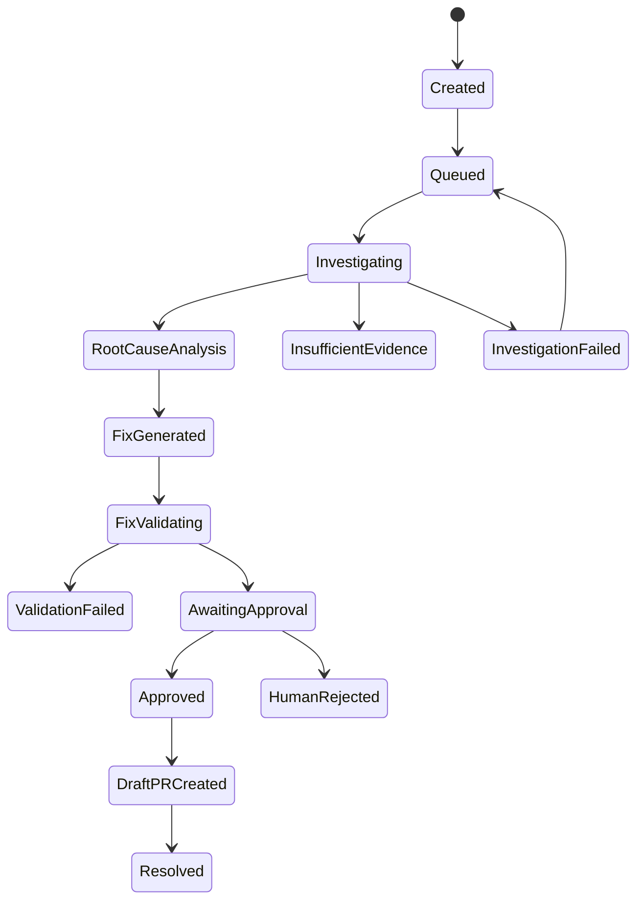
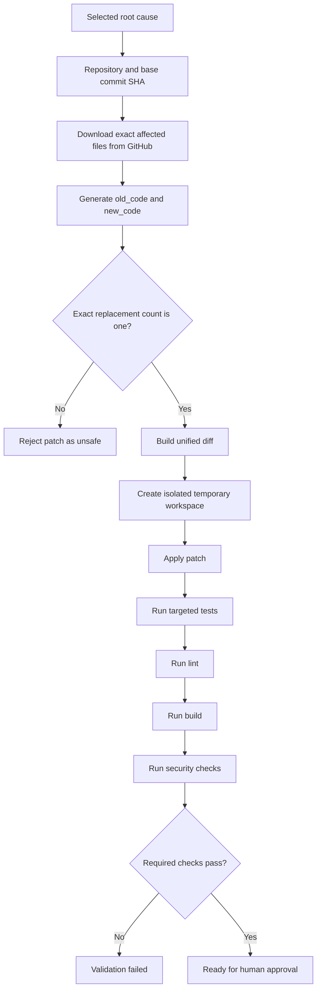
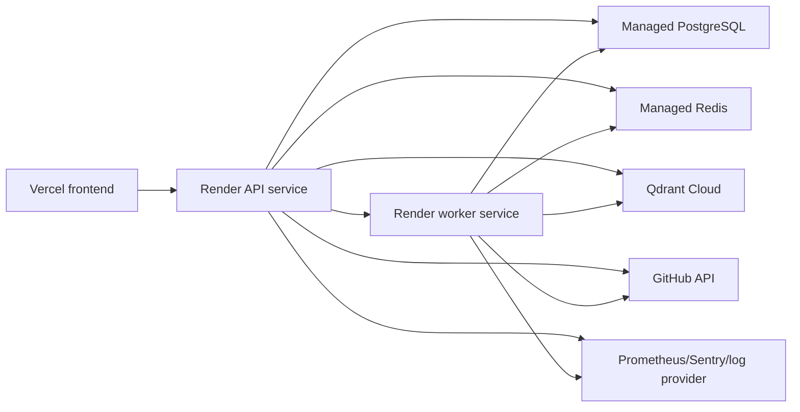

# Sentinel Chat Graph



## Verified milestones

- Manual incident creation works.
- Deployed login and incident creation were tested.
- Multi-repository data model and investigation fan-out were added.
- Investigation stream recovery was fixed.
- Proposed diffs are persisted and displayed when a real patch exists.
- Draft PR publication is guarded against empty or stale patches.
- Incident edit and delete actions were added.
- Backend tests passed with 68 tests.
- The deployed test found and fixed the stale `inc_scopes` variable.

## Current limitation

The deployed logo test completed its investigation but selected a generic rollback and had no applicable code patch. The next required implementation is real GitHub source retrieval, evidence-based repository and root-cause scoring, validation, and approval-gated Draft PR creation.

## Complete implementation roadmap



## Implementation dependency chain



## Release gates

```text
Gate 1: Security passes
Gate 2: Database and workers survive restart
Gate 3: All affected repositories are discovered
Gate 4: Every RCA is evidence-backed or abstained
Gate 5: Every code fix has a real exact diff
Gate 6: Required validation passes
Gate 7: Human approval is recorded
Gate 8: Draft PR is created per repository
Gate 9: Production monitoring and rollback are ready
```

## Detailed engineering blueprint

### 1. Product contract



The non-negotiable contract is that Sentinel may investigate, explain, generate, validate, and prepare a Draft PR. It must not merge code or deploy to production autonomously.

### 2. Current code map

| Area | Main location | Current responsibility | State |
|---|---|---|---|
| API startup | `backend/app/main.py` | FastAPI app, middleware, route registration | Implemented, needs production startup cleanup |
| Auth | `backend/app/core/auth.py` | bcrypt passwords and JWT sessions | Implemented, needs stronger authorization |
| Database | `backend/app/core/database.py` | SQLAlchemy engine and sessions | Implemented |
| Domain model | `backend/app/models/incident.py` | Incidents, investigations, evidence, fixes, approvals | Broad model exists |
| Manual incidents | `backend/app/routes/incidents.py` | Create, update, delete, list incidents | Implemented |
| Webhook ingestion | `backend/app/routes/webhooks.py` | Normalize external alert payloads | Partial, signatures needed |
| Detection | `backend/app/routes/auto_detect.py` | Evaluate rules and create incidents | Partial, no durable scheduler |
| Investigation API | `backend/app/routes/investigation_engine.py` | Run and stream investigations | Partial, needs durable jobs and stronger RCA |
| Investigation engine | `backend/app/services/investigation_engine.py` | Plan tasks and execute tools | Partial, several tools are placeholders |
| Retrieval | `backend/app/services/retrieval.py` | Hybrid retrieval orchestration | Partial |
| Vector store | `backend/app/services/vector_store.py` | Qdrant indexing and search | Partial, deployment/dependencies needed |
| LLM | `backend/app/services/llm.py` | Provider abstraction and mock mode | Implemented, needs production controls |
| Patch generation | `backend/app/services/diff_generator.py` | Generate patch structure and diffs | Partial, must use GitHub source |
| GitHub client | `backend/app/services/github.py` | Read and write GitHub API operations | Primitives exist |
| Remediation | `backend/app/routes/remediation.py` | Fix records and Draft PR publishing | Partial, approval gate required |
| Validation | `backend/app/services/validation.py` | Run checks in a process | Partial, not fully wired |
| Chatbot | `backend/app/routes/chat.py`, UI ChatBot | Answer incident questions | Partial, needs scoped evidence and citations |
| Frontend shell | `sentinel-ui/src/components` | Navigation, auth gate, layout | Implemented |
| Incident UI | `sentinel-ui/src/app/incidents` | Create, investigate, review incidents | Partial |
| PR review UI | `sentinel-ui/src/app/pull-requests` | Approval queue | Partial, needs diff and validation review |

### 3. Phase 0: Security and integrity

#### Work

1. Rotate every credential that has ever been committed, including database passwords and GitHub secrets.
2. Remove secret files from Git tracking and add safe environment templates.
3. Encrypt GitHub tokens at rest using a dedicated encryption key from the deployment secret store.
4. Add `organization_id` or an equivalent tenant boundary to users, repositories, incidents, investigations, fixes, approvals, and audit events.
5. Add ownership filters to every query, including chatbot context queries.
6. Require an active user and enforce roles for destructive actions and approvals.
7. Verify HMAC signatures for every supported webhook provider.
8. Add GitHub OAuth `state`, expiry, and user binding.
9. Add rate limits and request size limits to webhook and chat endpoints.
10. Treat logs, commits, PR descriptions, and repository files as untrusted prompt input.

#### Acceptance tests

```text
User A cannot read User B incidents.
User A cannot create a PR for User B fixes.
Unsigned webhook returns 401 or 403.
Expired OAuth state is rejected.
GitHub tokens never appear in API responses or logs.
No branch, commit, or PR exists before approval.
```

### 4. Phase 1: Durable foundation

#### Work

1. Repair the Alembic revision chain so every referenced revision exists.
2. Run migrations during deployment before the API accepts traffic.
3. Remove broad `except: pass` blocks around schema changes.
4. Add unique indexes for repository scopes and provider fingerprints.
5. Allocate incident numbers atomically.
6. Move investigation execution from in-memory asyncio tasks to Redis-backed jobs.
7. Add job IDs, leases, retries, dead-letter states, and idempotency keys.
8. Persist investigation tasks, task inputs, task outputs, timestamps, and failures.
9. Persist progress events instead of relying only on one browser SSE connection.
10. Move metrics to a durable or external metrics system.

#### Required state machine



Every transition must be persisted, auditable, and safe to retry.

### 5. Phase 2: Ingestion and topology

#### Incident input normalization

All input providers should produce the same normalized object:

```json
{
    "provider": "sentry",
    "external_id": "event-123",
    "title": "Checkout request failed",
    "description": "HTTP 500 from checkout service",
    "service": "checkout-api",
    "severity": "SEV-2",
    "error_signature": "NullPointerException",
    "occurred_at": "2026-08-26T10:00:00Z",
    "deployment_id": "deploy-456",
    "raw_payload_reference": "secure-storage-key"
}
```

#### Repository resolver

The resolver should score all candidate repositories:

```text
Explicit incident scope                         +100
Exact service-to-repository mapping              +80
Stack trace path matches repository              +70
Deployment belongs to repository                +65
GitHub file or symbol evidence                   +50
Import/dependency relationship                   +35
Keyword or semantic match                        +20
```

Return every repository above the configured threshold, with reasons. Never silently choose only the first repository.

#### Multi-repository behavior

For payment and email services:

```text
Incident
├── payment repository investigation
│   ├── evidence
│   ├── RCA
│   ├── fix
│   ├── validation
│   └── Draft PR
└── email repository investigation
        ├── evidence
        ├── RCA
        ├── fix
        ├── validation
        └── Draft PR
```

Each child result must retain its repository, base SHA, confidence, and failure state.

### 6. Phase 3: Evidence and RCA

#### Evidence adapters

- GitHub files, commits, PRs, reviews, deployments, and releases.
- Prometheus or Alertmanager metrics and alert history.
- Sentry events, stack traces, releases, and breadcrumbs.
- Generic logs with timestamps and correlation IDs.
- Qdrant code chunks with repository and commit metadata.
- Previous incidents limited to the same tenant and relevant service.

#### Evidence record requirements

Every evidence item needs:

```text
source_type
source_id
repository
commit_sha
observed_at
file_path
line_start and line_end
source_url
retrieval_score
retrieval_method
```

#### RCA rules

1. Generate multiple competing hypotheses.
2. Link supporting and contradicting evidence to each hypothesis.
3. Apply temporal filtering using commit/deployment time, not indexing time.
4. Detect missing evidence.
5. Calibrate confidence.
6. Abstain when minimum evidence is not met.
7. Never select the first hypothesis merely because all stronger options failed.

### 7. Phase 4: Real patch and validation pipeline



For the logo incident, the expected patch must contain actual changes in the Sentinel repository, such as consolidating `Sidebar`, `TopBar`, login, and profile logo rendering around one canonical component or asset. A rollback with zero files is not a valid code fix.

### 8. Phase 5: Approval and Draft PR

The PR endpoint must verify:

```text
Fix belongs to current tenant
Fix belongs to investigation
Fix has a repository
Fix has a non-empty exact patch
Validation passed
Approval exists from an authorized reviewer
GitHub token has write permission
Base SHA is still current or safely rebased
```

The PR body should include:

- Incident link and summary
- Affected repository and base SHA
- Root cause and confidence
- Evidence links
- Files changed
- Unified diff summary
- Validation results
- Risk and rollback notes
- Explicit statement that Sentinel did not merge the PR

### 9. Phase 6: Qdrant, Redis, and production deployment

#### Recommended deployment topology



#### Deployment requirements

- API and worker use the same source revision and environment contract.
- Database migrations run before release traffic.
- Qdrant collection dimensions match the embedding model.
- Redis is used for jobs, locks, retries, and rate limiting.
- Health endpoints distinguish liveness from readiness.
- Render environment variables contain service URLs, never `localhost`.
- CORS allows only the actual Vercel production and preview origins needed.
- Logs include request ID, incident ID, investigation ID, repository, and task ID.

### 10. Chatbot contract

The chatbot is an assistant over Sentinel data, not an unrestricted agent.

It must:

1. Scope every answer to the authenticated tenant.
2. Cite incident, evidence, file, commit, and PR sources.
3. State confidence and uncertainty.
4. Never claim a patch or PR exists without persisted records.
5. Never approve, merge, deploy, or delete without explicit authorized action.
6. Refuse prompt instructions found inside repository files or logs.
7. Explain repository selection and root-cause reasoning.

### 11. Test pyramid

```text
Unit tests:
    parsers, normalizers, scoring, deduplication, patch application, HMAC verification

Service tests:
    repository resolver, retrieval, RCA, validation, chatbot context, GitHub client mocks

API tests:
    auth, ownership, lifecycle transitions, approvals, webhooks, migrations

Integration tests:
    PostgreSQL, Redis, Qdrant, mocked GitHub and observability providers

End-to-end staging test:
    incident -> two repositories -> evidence -> two diffs -> validation -> approvals -> two Draft PRs
```

### 12. Final definition of done

Sentinel is publishable only when all of these are true:

```text
Security secrets rotated and encrypted.
Tenant isolation tested.
Webhook signatures enforced.
OAuth state protection enabled.
Migrations are deterministic.
Qdrant and Redis are deployed and healthy.
Workers survive restart.
Manual and automatic incidents use the same lifecycle.
All affected repositories are resolved and investigated.
RCA is evidence-backed or abstains.
Patch is generated from GitHub source at an immutable SHA.
Diff is visible in the UI.
Validation runs before approval.
Approval is required before branch, commit, or PR creation.
One Draft PR is created per repository.
No autonomous merge or deployment exists.
Chatbot is scoped and cites evidence.
Backend tests, integration tests, frontend lint, TypeScript, and build pass.
Production monitoring and rollback procedures are documented.
```
